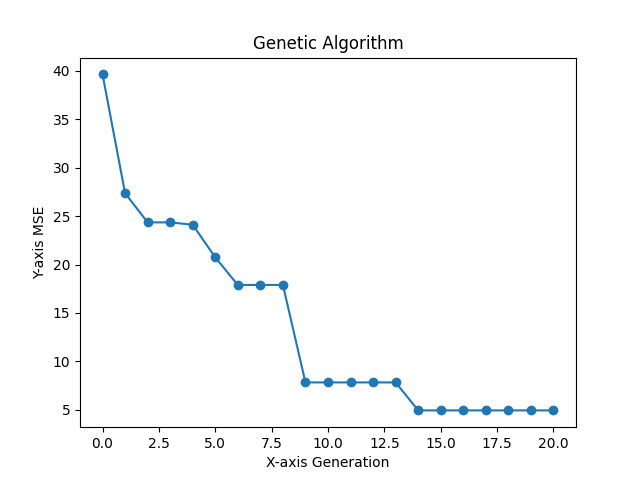

<h1>基於基因演算法優化機器學習模型之超參數研究-預測股市價格</h1>

<h2>重點摘要</h2>
在金融領域，準確預測股市價格是一個具有挑戰性的問題。本研究針對這一挑戰，提出了一種基於基因演算法（GA）的方法，用於優化機器學習模型，以預測台灣股市0050指數的未來收盤價格。

我們的研究著重於長短期記憶（LSTM）神經網路，這是一種廣泛應用於序列預測的深度學習模型。

為了提高LSTM模型的性能，我們使用GA優化超參數，包括神經網路的層數和訓練迭代次數。

這個過程的目標是最小化均方誤差（MSE），以實現更準確的預測。

總之，我的研究結合了機器學習、深度學習和遺傳演算法，以改進對股市價格的預測。

這對於金融市場的風險管理和資產配置具有重要價值，並提供了一個有前景的研究方向，可以應用於其他時間序列預測問題。

<h2>問題描述</h2>
在金融市場中，預測股市價格的準確性對於投資者和交易者至關重要。傳統的統計模型和機器學習方法已經被廣泛應用於這個領域，但隨著股市數據的複雜性和動態性不斷增加，優化預測模型以獲得更高的預測準確性變得至關重要。

LSTM（Long Short-Term Memory）神經網路已經證明在處理時間序列數據方面具有卓越的性能。然而，LSTM本身有多個超參數需要調整，包括神經網路的層數、每層的神經元數量以及訓練的迭代次數（epochs）。這些超參數的選擇對於模型的性能有著巨大的影響。

因此，本研究的問題是如何通過基因演算法優化LSTM神經網路的超參數，以改進股市收盤價格的預測準確性。具體而言，我們關心的是如何自動化這個過程，以找到最佳的超參數配置，從而實現對未來股市價格的更準確預測。

基因演算法被選為優化方法的一部分，因為它模仿了自然界中基因的進化過程，可以搜索超參數空間以找到全局最優解。這種方法的優勢在於其能夠處理高度非線性和大型參數空間的問題，這在深度學習模型中非常常見。

我們的目標是利用基因演算法，優化LSTM模型的層數、每層的神經元數量和訓練迭代次數，以最小化預測模型對0050股價數據的均方誤差（MSE）。通過這種方式，我們可以實現對未來某一日的0050收盤價的更精確預測，幫助投資者做出更明智的金融決策。

我使用0050指數的相關特徵作為輸入，包括日期、總成交股數、成交金額、開盤價格、最高價格、最低價格等，並以收盤價格作為輸出目標。

<h2>基因演算法摘要</h2>

本研究基因演算法的目標是通過遺傳算法來搜索最佳的LSTM神經網絡超參數，

以最小化0050股價數據的均方誤差（MSE），從而實現對未來某一日的0050收盤價的預測。

以下是這個基因演算法的詳細步驟：

問題描述：
輸入特徵（input）：日期（date）、總成交股數（capacity）、總成交金額（turnover）、開盤價（openprice）、盤中最高價（highprice）、盤中最低價（lowprice）、漲跌價差（change）、成交筆數（transcation）、日期時間戳（timestamp）、盤中均價（meanprice）。

輸出目標（output）：收盤價（close）。

初始化：
初始化神經網絡模型LSTM的超參數，包括層數（layer1、layer2、layer3）和訓練迭代次數（epochs）。
設置種群大小（init_population_size）和遺傳算法的迭代代數（generation）。
隨機生成初始個體，其中一個基於初始超參數，其餘的個體隨機生成。
編碼和解碼：
編碼方法將超參數（layer1、layer2、layer3、epochs）轉換為二進制編碼。
解碼方法將二進制編碼還原為超參數的數值。

適應度函數：
使用神經網絡模型訓練0050股價數據，併計算均方誤差（MSE）作為個體的適應度。適應度越低，表示個體的超參數設置越好。

選擇種群：
計算每個個體的適應度值。
按適應度值升序排序個體，選擇適應度最低的一部分作為下一代個體。

強制參數範圍：
對於新生成的個體，檢查其超參數是否在有效範圍內。如果不在範圍內，則進行調整。

交叉和變異：
從選定的父代個體中隨機選擇兩個個體。
進行交叉操作，生成兩個新的個體。
對新個體進行變異操作，隨機改變一些基因。
強制對變異後的個體進行參數範圍的限制。

迭代：
重複以上步驟，生成新的種群，並更新適應度值。

選擇最優個體：
在最後一代種群中選擇適應度最低的個體，即均方誤差最小的個體。

解碼最優個體：
解碼最優個體的超參數，得到最優的LSTM模型配置。

顯示結果：
繪製遺傳算法優化過程中的均方誤差圖表，以可視化優化過程。

返回結果：
返回最優的LSTM超參數配置，可用於進一步訓練模型以進行未來0050股價的收盤價預測。
通過這個基因演算法，你可以自動搜索最佳的LSTM模型配置，以提高對未來股價的準確性預測。這是一個充分利用遺傳算法和神經網絡的強大組合，用於解決複雜的時間序列預測問題。

<h2>適應函數簡介</h2>
適應函數在這個基因演算法中扮演關鍵的角色。它的主要目標是將編碼的超參數配置解碼為LSTM模型的結構和訓練參數，然後使用這些參數在測試集上進行股市價格的預測。最終的評估指標是均方誤差（MSE），它衡量了模型預測的收盤價格與實際價格之間的差異，MSE越低表示模型的預測越準確。

適應函數的運作過程如下：

解碼：從基因組參數中解碼LSTM模型的結構和超參數，包括層數（layer1、layer2、layer3）和訓練迭代次數（epochs）。

構建模型：使用解碼後的超參數配置來建立LSTM模型。這些超參數將指導模型的架構和訓練方式。

訓練模型：使用訓練集的股市價格數據，以解碼後的超參數配置訓練LSTM模型。

預測：使用訓練好的LSTM模型在測試集上進行股市價格的預測。

計算MSE：比較模型預測的價格與測試集中實際價格，計算均方誤差（MSE）。MSE越低表示模型預測越準確。

返回MSE：將計算得到的MSE值作為適應函數的輸出，以供基因演算法優化過程使用。優化過程將試圖找到最小化MSE的超參數配置，以改善LSTM模型的預測性能。

總之，適應函數在整個優化過程中的角色是評估每個超參數配置的效能，並尋找使MSE最小化的最佳配置。通過這個過程，您可以優化LSTM模型以更準確地預測股市收盤價格。

<h2>結果展示</h2>

在這項研究中，我們成功地使用基因演算法（GA）優化了我們的LSTM神經網路模型，以預測0050股票的未來收盤價格。透過20代的迭代，我們取得了卓越的成果，將均方誤差（MSE）從最初的40降低到4.94。

MSE是一個關鍵的性能指標，它衡量了我們的模型預測與實際觀察之間的誤差。更低的MSE值代表我們的模型更準確地預測了0050股票的價格走勢，這對於投資決策和金融領域的應用具有極大價值。

通過基因演算法，我們調整了LSTM模型的超參數，包括神經網絡的層數和訓練迭代次數等，以實現更佳的性能。這個成就不僅代表了我們對機器學習模型的優化能力，還為金融市場預測提供了一個更可靠的工具。

總之，我們的研究證明了基於GA的超參數優化方法在改進股市價格預測方面的有效性。

<h2>用法</h2>
使用 $python GA.py
以訓練神經網路超參數。

將GA結果帶入44行 data = {'layer1': 259, 'layer2': 410, 'layer3': 473, 'epochs': 7}，使用python nn_0050.py，即可訓練模型。
